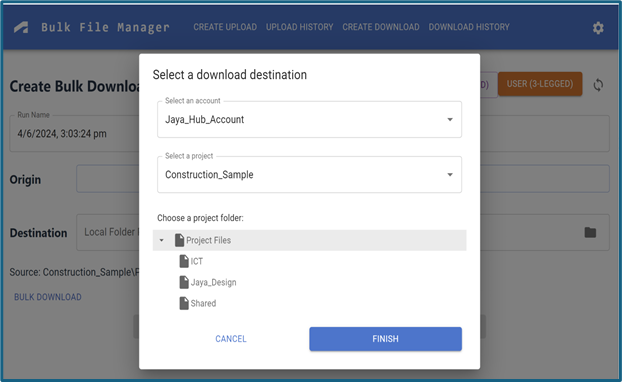
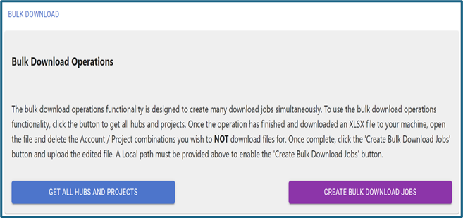
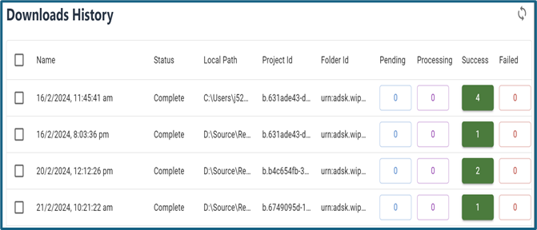
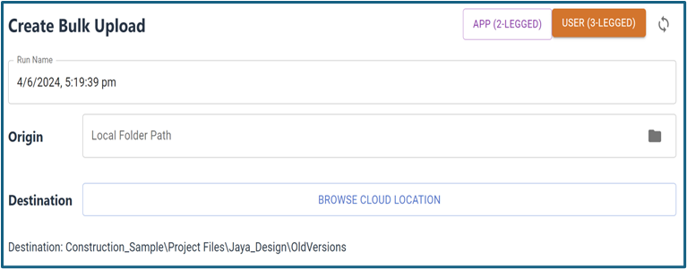
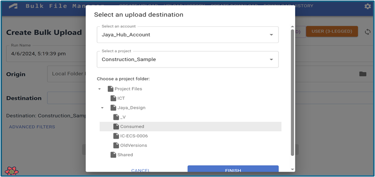
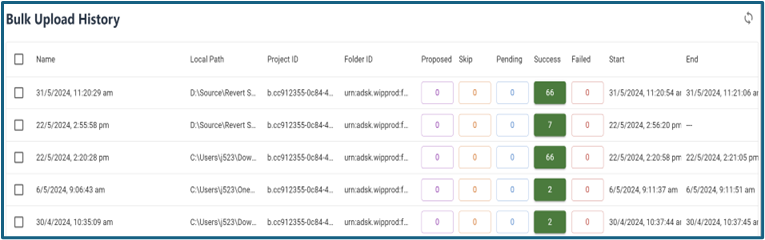
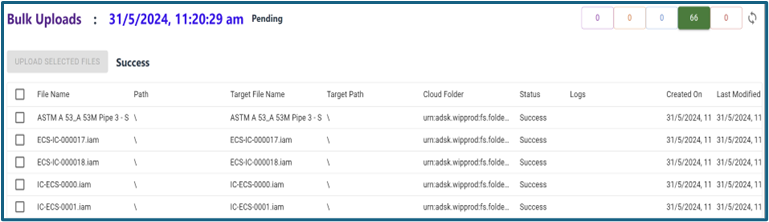

## User Guide
 
This is a help document about main functionalities and usages of this application. If you are developer who want to debug or extend the ability of this application, please also check the readme for developers if any note would be useful.

Before running this application, please follow the prerequisites and running locally [Read Me](../README.md#running-steps). After building successfully, unzip the release package, and run the `Bulk-File-Manager.exe` file. Or start debugging if you are developer.

## Table of Usages
<!-- TOC -->
   * [Select Authentication Modes](#select-authentication-modes)
      * [App-based Authentication](#app-based-authentication)
      * [User-based Authentication](#user-based-authentication)
   * [Download Files from Single Folder](#download-files-from-single-folder)
   * [Download Files from Multiple Folders](#download-files-from-multiple-folders)
   * [Download Progress](#download-progress)
   * [Upload Files](#upload-files-to-folder)
   * [Upload Progress](#upload-progress)
   * [Additional Options](#additional-options)
<!-- TOC -->
 
## Select Authentication Modes

The application supports two types of authentication: App-based (2 Legged) and User-based (3 Legged). 

With current integration mechanism of BIM360 or ACC, __App Based Authentication__ will allow this application to work with any files & folders in any Autodesk Hubs that APS client id has access to. __User Based Authentication__ will limit the application to work with files & folder that logged user account has access to. 

Note: BIM360 Teams supports User-based (3 Legged) only.

### App Based Authentication
1. In the first time running this application, it will ask you to input your APS client id and client secret. If you have setting file (json), click `Import Settings`.
2. After inputting, click Save & Login, it will launch the main UI. 
3. To change the client id and secret, click Settings, switch to `App-2legged`. After changing, click `Save Changes`.
4. Next time when running this application, it will read the settings from local database file and launch main UI directly.

### User Based Authentication
1. In the main UI, click `User (3 Legged)` button at the top of the page. It will pop out the login window. 
2. Go through the log in flow in the pop-up window, inputting the account users credential. 
3. When the log in window closes, press the 'sync' button to the right of the 'User (3 Legged)' button.
4. To reset the login cache to switch to other users,.....??? (have to restart this application?)

## Download Files from Single Folder

1. Click 'Create Download' at the top of the page
2. Click `Browse Cloud Location`
3. Select the account and project from the dropdown
4. Select the folder from the tree view
5. Click `Finish` to close the popup
6. Select the source folder by clicking the folder icon in the `Local Folder Path` field.
7. Press `Download Files` to start the download.
       

### Download Files from Multiple Folders
1. Select the source folder by clicking the folder icon in the `Local Folder Path` field.
2. Click `Bulk Download`
3. Click `Get all hubs and projects`
4. Wait until the Excel file is downloaded
5. Open the Excel file and remove any projects that you don't want to download
6. Click `Create Bulk Download Jobs`
7. Select the excel file.
   
    

### Download Progress

1. Click `Download History` at the top of the page
2. The list will automatically update every 15 seconds, but may also be refreshed by pressing the `Sync` button at 
   the top right of the page.
3. To view the details of a group of downloading files, press the colored button with the number of files.
4. To restart a failed download, select the files you with to repeat and press `Retry Selected`
     

###  Upload Files to Folder

1. Click 'Create Upload' at the top of the page
2. Select the target folder by clicking the folder icon in the `Local Folder Path` field.
3. Click `Browse Cloud Location`.
      
4. Select the account and project from the dropdown
5. Select the folder from the tree view
6. Click `Finish` to close the popup
   
7. To see what files and folders would be uploaded, press `Create Dry Run`
8. To upload the files, press `Upload Files`

## Upload Progress

1. Click `Upload History` at the top of the page
   
2.  The list will automatically update every 15 seconds, but may also be refreshed by pressing the `Sync` button at  the top right of the page.
   
3. To view the details of a group of uploading files, press the colored button with the number of files.
4. To restart a failed upload, select the files you with to repeat and press `Retry Selected`
5. To view the details of a bulk upload, click the row of the Bulk Upload you wish to view.

  ## Additional Options

- By `Advanced Filters` when Create Upload, you may select files types to exclude, folder names to exclude, or write custom Javascript to determine which files should be uploaded or downloaded.
- Settings >> `Hangfire` provides the dashboard on the jobs of uploads and downloads.
- Settings >> `Utilities` allows you to dump available hubs(accounts), projects, folders etc. to excel file.
- The `flower icon` on the bottom right corner is the console that tracks the logs of each HTTP traffic. 
5. To restart a failed upload, select the files you with to repeat and press `Retry Selected`
6. To view the details of a bulk upload, click the row of the Bulk Upload you wish to view.
