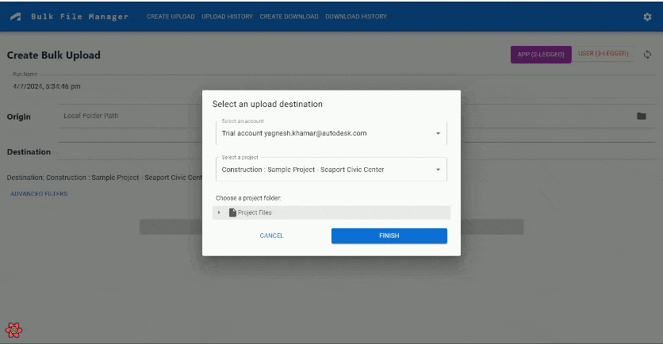
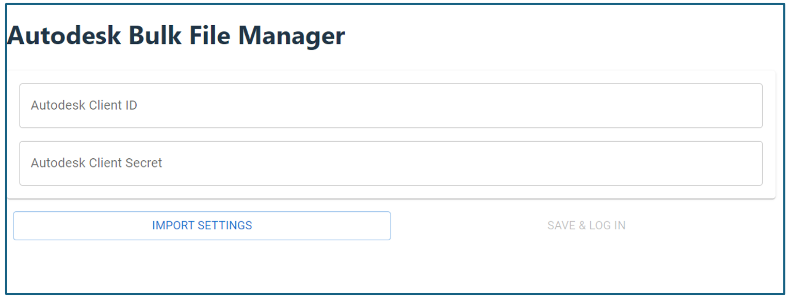

# APS Hubs Bulk File Manager

# Description
This is a desktop based application for uploading/downloading the files between the local machine and the folders of Autodesk BIM 360, Autodesk Construction Cloud(ACC), Autodesk BIM360 Teams etc. Application context authentication (2legged token) and user context authentication (3legged token) are supported. The users can download files from single folder or multiple folders. It provides jobs manager of the uploading/downloading and advanced features to track the traffic.

This application can be a product level tool for users to batch uploading/downloading files. It is also extensible for those advanced developers to add/adjust functionalities.

# Thumbnail

 
 
 

# Demo

## Prerequisites
- Knowledge of Data Management API of Autodesk Platform Services (APS)
- Knowledge of .NET Framework and WinForms in C#
- Install Visual Studio (Windows version)
- Install .NET 8 Runtime [installer](https://dotnet.microsoft.com/en-us/download/dotnet/8.0)
- Install [Node.Js](https://nodejs.org/en/download/prebuilt-installer) along with npm
- Install Webview2 Evergreen Runtime
- Create Autodesk APS app to get developer credentials. Visit [Autodesk Platform Sevices Portal](https://aps.autodesk.com), sign up for an account, then [create an app](https://aps.autodesk.com/myapps/create). For this new app, select the type of Web Application as this application will support both 2legged and 3legged authentication. Next input **http://localhost:8083/code** as Callback URL. Finally take note of the **client id** and **client secret**. 
- If you work with BIM360 or ACC, you will also need additional step to connect your APS App to the BIM360 or ACC account. Follow the [tutorial](https://aps.autodesk.com/en/docs/bim360/v1/tutorials/getting-started/get-access-to-account/)

 ## Running Steps
1. Clone this project or download it. It's recommended to install [GitHub desktop](https://desktop.github.com). To clone it via command line, use the following command line on Windows:

    ``git clone https://github.com/autodesk-platform-services/aps-hubs-bulk-files-manager.git``

2. Build the publish version of this application by the following commandline in the root solution folder (same folder of `bulk-file-manager.sln`). This will install required packages automatically and build distributable application at: \aps-hubs-bulk-files-manager\bin\Debug\net8.0-windows\win-x64\publish\

    ``dotnet publish -r win-x64``  

4. Run the application file `Bulk-File-Manager.exe`, it will launch the tool with login form. Please enter your APS **client id** and **client secret**. This activity will be conducted only once, as the application will save these details in the database for future authentication. If you have already setting file (json), click Import Settings to configure the setting.

   

4. For detailed functionalities and usages, please check [User Guide](Documentation/user-guide.md).

5. If you are developer who want to debug or extend the ability of this tool, please also check the [Developer Guide](Documentation/developer-guide.md). The notes would be useful when you testing with the code.

## Further Reading
- [Upload Documents to BIM360 or ACC](https://aps.autodesk.com/en/docs/bim360/v1/tutorials/document-management/upload-document-s3/): the workflow how to upload a local file to folder of BIM360 or ACC.
- [Download Documents from BIM360 or ACC](https://aps.autodesk.com/en/docs/bim360/v1/tutorials/document-management/download-document-s3/): the workflow how to download model of BIM360 or ACC to local.
- [APS Tutorial of HubBrowser](https://tutorials.autodesk.io/tutorials/hubs-browser/): tutorial on accessing models of BIM360 or ACC and load them in APS Viewer in the browser.
- [Electron .NET](https://developer.mescius.com/blogs/building-cross-platform-desktop-apps-with-electron-dot-net):  development of desktop applications using web technologies such as the Chromium rendering engine and the Node.js runtime
- [Hangfire](https://www.hangfire.io/): Web monitoring UI which is implemented as an OWIN extension and can be hosted inside any application – ASP.NET, Console or Windows Service.
- [Bogus](https://github.com/bchavez/Bogus): load databases, UI and apps with fake data for testing needs.
- [Fody](https://codingcanvas.com/code-weaving-using-fody/): extensible library for weaving .NET assembly
- [Polly](https://www.pollydocs.org/): .NET resilience library
  

# License
This sample is licensed under the terms of the [MIT License](http://opensource.org/licenses/MIT).
Please see the [LICENSE](LICENSE) file for more details.

# Written by
Based on the Bulk Upload Utility, by Autodesk Consulting:  
  -  Developer/Architect: Daniel Clayson
  -  Developer: Riley Peterson
  -  Architect: Tim Burnham
  -  Architect: Robert Angus
    
Open Source Maintainers
  -  Jayakrishna K [@JKAdskHub](https://github.com/JKAdskHub)
